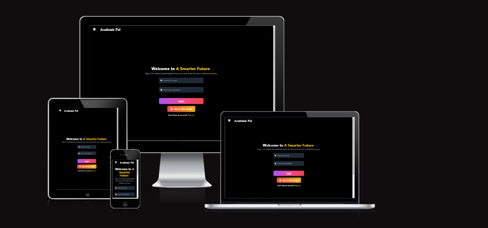

# AcademicPal 📚  

  

Welcome to **AcademicPal**, your ultimate learning companion designed for college students. From comprehensive notes to detailed syllabi and question banks, AcademicPal empowers you with everything you need for academic success!

---

## 🌟 **Features**
### What makes **AcademicPal** stand out:
- 📚 **Comprehensive Notes**: Access high-quality, curated notes for all subjects.
- 📝 **Past Question Papers**: Prepare smarter with previous years' question papers.
- ❓ **Important Questions**: Get a list of essential questions to focus your studies.
- 📄 **Detailed Syllabus**: Never miss a topic with a detailed syllabus for each course.
- 🔍 **Extensive Question Banks**: A rich collection of questions for deep practice.
- 🎓 **Branch-Wise Resources**: Explore tailored content for branches like AI, CSE, Mechanical, and more.

---

## 🚀 **How to Use AcademicPal**
1. Visit [AcademicPal](https://academicpal7.onrender.com).
2. Sign up or log in using your NMAMIT email.
3. Navigate through the branches, select your semester, and access resources like notes, question papers, and syllabi.
4. Utilize the search feature for quick access to specific materials.

---

## 📱 **Progressive Web App (PWA) Support**
AcademicPal is a PWA!  
- Add AcademicPal to your home screen for quick access.  
- Enjoy a seamless offline experience with cached resources.  

---

## 🤝 **Contributing**
We welcome contributions! If you'd like to help improve AcademicPal, follow these steps:  
1. Fork this repository.  
2. Create a new branch: `git checkout -b feature/YourFeature`.  
3. Commit your changes: `git commit -m "Add your feature"`.  
4. Push the branch: `git push origin feature/YourFeature`.  
5. Open a pull request.

---

## 📬 **Contact**
For any queries, suggestions, or collaborations, feel free to reach out:  
- 🌐 Website: [AcademicPal](https://academicpal7.onrender.com)  
- 📧 Email: nnm23cs256@nmamit.in  
- 🐦 GitHub: [Hari-hara7](https://github.com/Hari-hara7)  
- 💼 LinkedIn: [Hari Hara Nath](https://www.linkedin.com/in/hari-hara-nath-a13583282/)  

---

---

---

## 🛠️ **Technology & Tech Stack** 🚀

 

AcademicPal is built using a modern stack to provide an intuitive, fast, and interactive user experience. Here's the tech that powers it:

### **Frontend** 💻
- **React.js**: A dynamic JavaScript library for building fast, interactive UIs. ⚡️
- **Tailwind CSS**: A utility-first CSS framework to create sleek and responsive designs with ease. 🎨
- **Typewriter.js**: Adds a fun and interactive typewriter effect for dynamic text. 🖋️
- **React Router**: Enables smooth and efficient navigation between pages. 🔄
- **FontAwesome Icons**: Beautiful, scalable icons for a clean, minimalistic UI. 🖼️

### **Backend** 🔙
- **Firebase Authentication**: Secure, scalable, and easy-to-integrate authentication system. 🔑
- **Firebase Hosting**: Fast, secure, and reliable hosting to serve our web app. ⚡️

### **Database** 📚
- **Firestore (Firebase)**: A real-time, flexible NoSQL database for storing and syncing data. 💾

### **Progressive Web App (PWA)** 📲
- Full offline capabilities and home screen installation support for mobile and desktop. 📱
- **Service Workers** to enhance performance, caching, and offline access. ⏳

### **Other Tools & Libraries** 🛠️
- **Google Analytics**: Integrated for tracking user behavior and insights. 📊
- **GSAP/Three.js** *(coming soon)*: Advanced 3D animations and interactivity for a richer user experience. ✨
- **React Simple Typewriter**: Adding more creativity with animated typing text. 💬

---

This powerful tech stack allows **AcademicPal** to deliver a **smooth**, **high-performance**, and **responsive** experience for all users. 🌟
